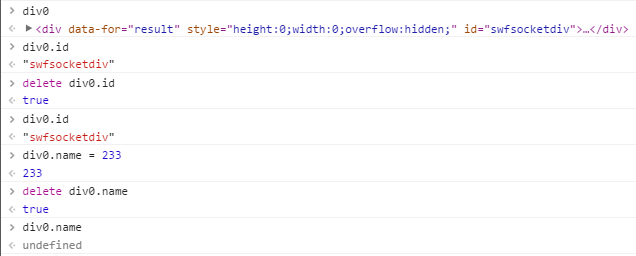

# DOM的attribute和property
> 虽然翻译过来都有“属性”的意思，而在《js高级程序设计》书中翻译为“特性”和“属性”。
简单理解，Attribute就是dom节点的属性(id,class,title,align,style等)。而Property就是把这个DOM对象当成JS对象时，其附加的内容(childNodes，firstChild)。

> 另外，常用的Attribute，例如id，class，title等，已经被当作Property附加到DOM对象上，可以和Property一样取值和赋值。 

## Attribute
就是 `nodeType=2`的属性节点，并有nodeName和nodeValue对应其属性名和属性值。
对于所有`nodeType=1`的元素节点，都会有一个`attribute`属性，是包含所有属性节点信息的NameNodeMap，map里的属性就是这里所说的attribute。

`Attribute`几乎是直接影响文档树（除了自定义额外添加的，eg:`data-XXX`）

## Property
就是对dom对象`装箱`成JS对象后，里面包含了更多的属性信息。eg：innerHTMl，childNode。对于该`JS对象`使用`delete`操作符删除它们的属性时候，在chrome下都是返回`true`，但是真正可以删除的仅有那些自定义加进去的属性才是真正删除，其它的还能正确访问。

## 交集
把两者放在一起来讨论，是因为它们间有些`基情`。在`Attribute`和 `Property`中有些`交集`，例如：id。并且无论是通过`attribute`或是`property`来操作id，都能准确反映出来。

* 操作`Attribute`是通过`getAttribute`/`setAttribute`来操作属性，并且操作结果可以在`dom树`上实时看到(`通过DevTools 的Elements`),并且其`get`/`set`操作的都是字符串形式的参数。

* 操作`Property`只要通过`.`/`[]`来操作就行，和操作其他的JS对象一致，并且操作的值可以是任何类型(`这里就可能有循环引用，已经一些内存泄漏问题`)

* 在两者可以操作的'交集`属性`中，有些要注意的：对于'Attribute'中的`class`，在`Property`中是`className`。对于`Attribute`中的'style'(`这样只能获取获取到写在dom上的内嵌样式，并且是字符串形式`)，对应于`property`中也是`style`，但是操作的不是字符串，而是一个CSSStyleDeclaration对象，其包含着样式的所有信息(`但是这不是当前dom实际采用的样式`，需要使用`getComputedStyle`/`currentStyle`来获取实际获取在dom上的样式)

* 对于h5开始使用的`data-xxx`的自定义属性，通过`Attribute`操作的话是和其他的一视同仁，而通过`property`来操作的话，要先访问`data-set`再来访问那些属性，并且去掉前缀`data-`  [更多关于自定义属性的介绍，可以看看张大大的博客。](http://www.zhangxinxu.com/wordpress/2011/06/html5%E8%87%AA%E5%AE%9A%E4%B9%89%E5%B1%9E%E6%80%A7%E5%AF%B9%E8%B1%A1dataset%E7%AE%80%E4%BB%8B/)