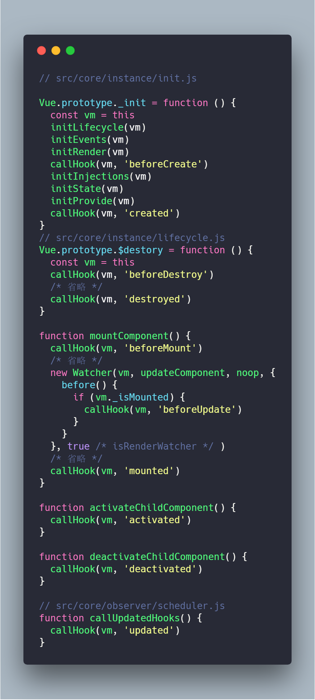

# vue的总结

### 前言

    为什么我们需要vue、react这些前端框架：
    主要是现代网页变得越来越动态化和强大了，而多亏了JavaScript。越来越多的服务端代码被放到浏览器中，而这样就产生越来越多的JavaScript代码，这些js代码把相应的html，css代码组合起来，构成页面，
    但是缺乏正规的组织形式。
    而这些JavaScript框架正是为了解决这些困扰。

    在后端编写页面模板的时代，页面就是由那些页面模板搭配上viewModle数据，组合而成的前端界面。而现在的前端界面就是由前端ajax请求回来的数据搭配前端编写的template或render方法来组合成界面。在初次渲染的时候，两者的区别不是特别大。区别比较大的是在数据变化后的再次渲染，使用vue框架，它可以响应式地知道页面哪里需要再次渲染。

### MVVM模型

    虽然vue并没有完全遵循MVVM模型，但是其设计也是受其启发的。因此，有兴趣，有余力的可以了解下:

  MVVM(Model-view-viewmodel)是一种软件架构模式。
  
  

  作用是分离 `图形用户界面` 的开发与 `业务逻辑` 或 `后端逻辑` 的开发,这是通过`标记语言(eg:HTML/XML)` 或 `GUI` 代码实现的。 MVVM的视图模型是一个值转换器。意味着视图模型负责从模型中暴露(转换)数据对象，以便轻松管理和呈现对象。视图模型可以实现`中介者模式`，组织对视图所支持的用例集的后端逻辑的访问。

  更多详情可以看这里 [wiki:MVVM](https://zh.wikipedia.org/wiki/MVVM);

  ### 生命周期

  说到生命周期，记得文档里的这张图就差不多了：
  

  还有在代码中出现这些钩子的时机，留意下：
  

  从这些图，可以掌握到信息由：
  
  1. `beforeCreate`：
     * vm实例上没有还没有代理到`data`数据选项以及`methods`里的方法，因此通过`this[key]`来访问或赋值都不显示，此时他们还在`this.$optioins`上
     * 日常开发时，很少用到这个钩子，虽然可以做到在此刻进行异步加载，但是那些加载的UI效果难以显示(当然，如果那些`loading`是不依赖当前实例，也是可以显示的)。

  2. `created`:
     * 通过`initState`方法，把`props`,`methods`,`data`以及`computed`,`watche`配置选项都挂载在实例上了，里面的数据已经准备好收集依赖了。
     * 日常开发常用些，毕竟常用的要访问的实例属性可以修改和访问了，并且修改数据还不会引用页面再次渲染(毕竟还没开始渲染...)。有时候从storage那值会在这步

  3. `beforeMount`:
     * 这个钩子也比较少用到，这步的主要目的就是确保当前`vm`实例的`render`函数准备好，如果代码是采用`template`的，到这步的时候，它也被编译成`render`函数了。

  4. `mounted`:
     * 这个钩子表明，页面根据当前的`data`第一次渲染成功，并挂载到了正在dom树上
     * 经常用到，在这里做异步请求，展示些UI,获取dom节点的信息等。
  
  5. `beforeUpdate`,`updated`:
     * 这两个钩子发生在Vnode更新前，以及更新后
     * 比较少用
  
  6. `beforeDestory`:
     * 实例要被销毁之前，此时可以干些缓存下数据之类的活

  7. `destroyed`:
     * 表示实例已经凉透了